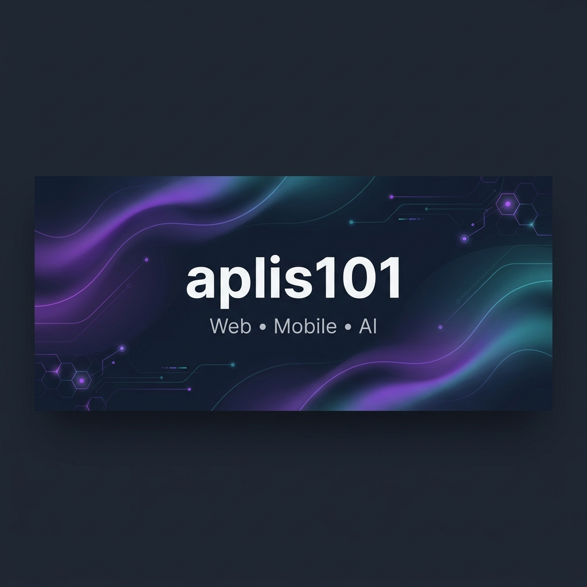

# aplis101 | Full-Stack & AI Developer

# أهلاً بك في ملفي الشخصي! 👋

أنا مطور برمجيات متكامل (Full-Stack Developer) متخصص في بناء حلول برمجية مبتكرة تجمع بين الأداء العالي والتصميم العصري. أركز بشكل خاص على تطوير تطبيقات الويب المتقدمة باستخدام **Next.js**، تطبيقات الهواتف الذكية باستخدام **Flutter**، ودمج تقنيات **الذكاء الاصطناعي التوليدي** والوكلاء الأذكياء (**AI Agents**).

---

### 🚀 About Me / نبذة عني
- 💻 Specialized in building robust web applications with **Next.js**, **React**, **TypeScript**, and **Supabase (PostgreSQL)**.
- 📱 Designing beautiful, native mobile experiences using **Flutter** & **Dart**.
- 🤖 Integrating state-of-the-art **Generative AI** models and orchestrating autonomous **AI Agents**.
- 🛠️ Dedicated to writing clean, maintainable code, implementing modern design systems, and deploying scalable architectures.

---

### 🛠️ Tech Stack & Skills
A curated collection of technologies I work with daily, styled with a minimalist and professional dark theme:

#### **Frontend & Mobile Development**

  
  
  
  
  
  

#### **Backend & Cloud Infrastructure**

  
  
  

#### **AI Integration & Engineering**

  
  

---

### 📊 GitHub Analytics

  
  

---

### ⚡ Recent Activity
Below is an auto-updating stream of my latest activity on GitHub:

<!-- START_SECTION:activity -->
<!-- END_SECTION:activity -->

---

  <i>"Simplicity is the ultimate sophistication."</i>

